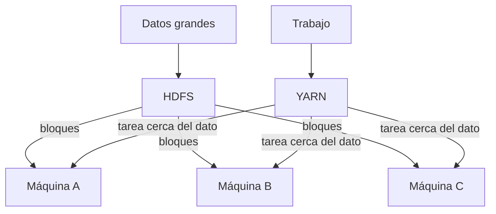

# Fundamentos de Hadoop

## El problema que intenta resolver

Supón que debes procesar varios terabytes de registros. En una sola máquina
aparecen tres límites:

1. **Capacidad:** el disco puede no ser suficiente.
2. **Tiempo:** un único procesador tarda demasiado.
3. **Disponibilidad:** si la máquina o el disco fallan, el trabajo y los datos
   quedan en riesgo.

Comprar una computadora cada vez más grande se conoce como **escalamiento
vertical**. Hadoop nació alrededor de otra estrategia: conectar muchas máquinas
comunes y repartir entre ellas el almacenamiento y el procesamiento, es decir,
**escalamiento horizontal**.

Distribuir no elimina la complejidad. Introduce fallos parciales, transferencias
por red, sincronización y planificación de recursos. Hadoop proporciona
componentes para administrar esos problemas.

## Qué es Apache Hadoop

Apache Hadoop es un framework de software libre para almacenar y procesar grandes
conjuntos de datos de forma distribuida. Sus módulos centrales son:

| Módulo | Responsabilidad |
| --- | --- |
| **Hadoop Common** | Bibliotecas, configuración y utilidades compartidas. |
| **HDFS** | Sistema de archivos distribuido, optimizado para alto rendimiento secuencial. |
| **YARN** | Administración de recursos y planificación de aplicaciones. |
| **MapReduce** | Modelo y motor de procesamiento paralelo por lotes sobre YARN. |

Hadoop NO es una base de datos única ni una interfaz gráfica. Es una plataforma
compuesta por procesos, bibliotecas, protocolos, comandos e interfaces web.

## Almacenamiento y cálculo son responsabilidades diferentes

Esta separación es fundamental:

- HDFS puede conservar archivos aunque no haya un trabajo ejecutándose.
- YARN puede administrar aplicaciones distintas de MapReduce.
- MapReduce utiliza HDFS como fuente/destino y YARN para obtener recursos.

## Llevar el cálculo hacia los datos

Mover terabytes por la red hacia un único procesador es caro. Hadoop intenta
ejecutar las tareas en los nodos donde se encuentran los bloques que necesitan,
o tan cerca como sea posible. Esta **localidad de datos** reduce tráfico de red y
permite procesar muchas partes al mismo tiempo.

En nuestro laboratorio todos los contenedores están en el mismo equipo, de modo
que podemos observar la arquitectura, pero no obtener el beneficio físico de
varios servidores y redes.

## Formas de ejecución

Hadoop puede ejecutarse en tres modalidades conceptuales:

1. **Local o standalone:** un solo proceso, útil para desarrollo sencillo.
2. **Pseudodistribuida:** una máquina, pero daemons separados.
3. **Completamente distribuida:** varios nodos físicos o virtuales.

Nuestro entorno se parece a una instalación pseudodistribuida desde el punto de
vista físico, porque utiliza una sola computadora. Sin embargo, separa cada
daemon principal en su propio contenedor para que los roles sean visibles.

## Qué significa “daemon”

Un daemon es un proceso de larga duración que espera solicitudes y realiza una
función del sistema. Por ejemplo:

- NameNode mantiene los metadatos de HDFS.
- DataNode conserva bloques.
- ResourceManager administra los recursos del clúster.
- NodeManager ejecuta y vigila trabajo en un nodo.

Docker inicia y aísla estos procesos. Hadoop sigue comunicándose mediante sus
protocolos normales; no es una simulación ni una reimplementación.

## Qué NO demuestra este laboratorio

- Alta disponibilidad del NameNode.
- Replicación entre varias máquinas.
- Recuperación ante la pérdida real de un servidor.
- Seguridad Kerberos, TLS o aislamiento multiusuario.
- Rendimiento representativo de un clúster.

El laboratorio es potente para aprender el flujo completo, pero sería un error
confundir **servicios distribuidos separados** con **hardware realmente
distribuido**.

## Fuente oficial

- [Módulos de Apache Hadoop](https://hadoop.apache.org/modules.html)
- [Configuración oficial de un solo nodo](https://hadoop.apache.org/docs/current/hadoop-project-dist/hadoop-common/SingleCluster.html)

**Siguiente:** [HDFS: almacenamiento distribuido](02-hdfs.md).

