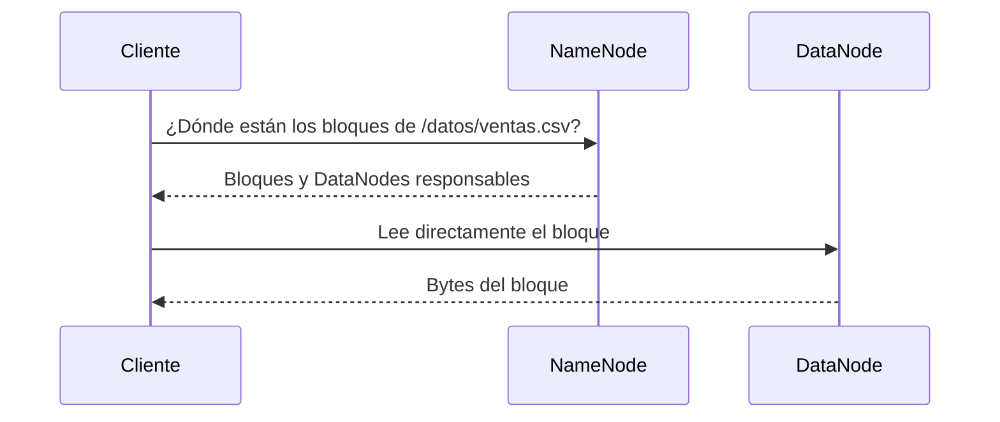
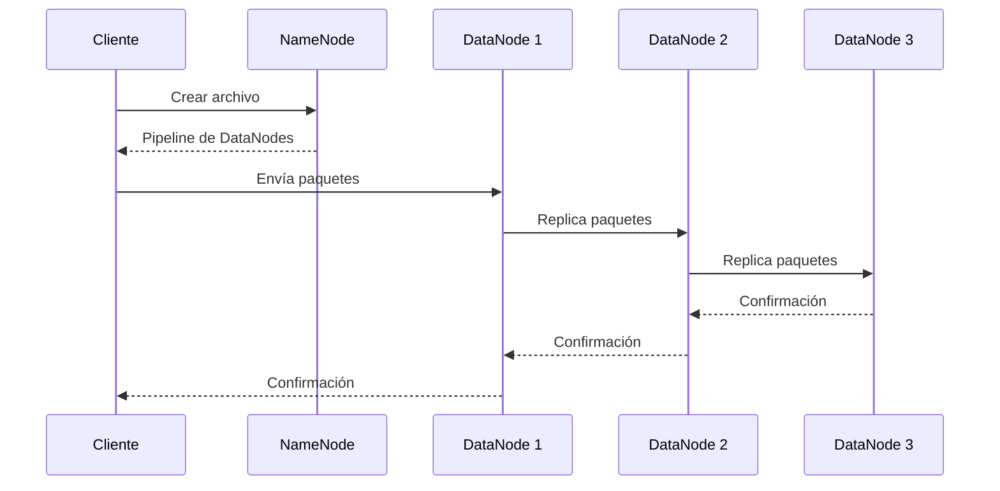

# HDFS: almacenamiento distribuido

## Qué es HDFS

HDFS significa **Hadoop Distributed File System**. Presenta archivos y
directorios al usuario, pero internamente divide los archivos en bloques grandes
y distribuye esos bloques entre DataNodes.

Está diseñado principalmente para:

- archivos grandes;
- lecturas secuenciales de alto rendimiento;
- escribir una vez y leer muchas veces;
- continuar operando cuando fallan discos o nodos, si existen réplicas.

No está pensado para reemplazar el sistema de archivos local en cualquier caso.
El acceso de muy baja latencia, las modificaciones aleatorias constantes y
millones de archivos diminutos son escenarios desfavorables.

## NameNode y DataNode

| Servicio | Conserva | Responsabilidad |
| --- | --- | --- |
| **NameNode** | Metadatos | Directorios, nombres, permisos y relación entre archivos y bloques. |
| **DataNode** | Datos | Bytes de los bloques almacenados en disco. Atiende lecturas y escrituras. |

El NameNode no transporta normalmente todos los bytes de un archivo. El cliente
consulta al NameNode para localizar bloques y después se comunica directamente
con los DataNodes.



## Bloques

Un archivo grande se divide en fragmentos llamados **bloques**. El tamaño es
configurable; 128 MiB es un valor típico en Hadoop moderno. Usar bloques grandes
reduce la cantidad de metadatos y favorece transferencias secuenciales.

Un archivo menor que un bloque no ocupa obligatoriamente todo ese tamaño: el
bloque lógico puede contener menos bytes. El problema de los archivos pequeños
no es “desperdiciar 128 MiB por archivo”, sino multiplicar metadatos y operaciones
que el NameNode debe mantener.

## Replicación

En un clúster real, HDFS puede conservar varias copias de cada bloque. Si el
factor de replicación es `3`, cada bloque tiene como objetivo tres réplicas en
DataNodes distintos, sujetas a la política de colocación.

Los DataNodes envían al NameNode:

- **heartbeats**, que indican que siguen activos;
- **block reports**, que enumeran los bloques almacenados.

Cuando una réplica desaparece, el NameNode puede ordenar la creación de otra. La
replicación aporta tolerancia a fallos, pero consume capacidad adicional.

### Por qué nuestro laboratorio usa replicación 1

Solo tenemos un DataNode. La configuración es:

```xml
<property>
  <name>dfs.replication</name>
  <value>1</value>
</property>
```

Esto es coherente para estudiar y evita solicitar copias imposibles. Sin embargo,
**replicación 1 no tolera la pérdida del DataNode o de su volumen**. No debe
presentarse como una configuración de producción.

## Flujo de escritura



El diagrama representa replicación 3. En el laboratorio, el pipeline termina en
el único DataNode.

## Metadatos persistentes

El NameNode persiste el espacio de nombres principalmente mediante:

- **FsImage:** imagen del estado del sistema de archivos.
- **EditLog:** registro de cambios posteriores.

Formatear el NameNode crea una identidad nueva para el sistema de archivos. Por
eso el script de inicio solo ejecuta `hdfs namenode -format` cuando no existe la
marca `current/VERSION`. Formatear en cada arranque destruiría la relación con
los datos anteriores.

En Docker, los directorios están respaldados por volúmenes nombrados:

- `namenode-data` para metadatos;
- `datanode-data` para bloques.

`docker compose down` elimina los contenedores, pero conserva esos volúmenes. El
script `reset.sh` sí los elimina deliberadamente.

## Ruta local frente a ruta HDFS

Son espacios diferentes:

```text
/tmp/ventas.csv          archivo local dentro del contenedor
/datos/ventas.csv        ruta lógica dentro de HDFS
hdfs://namenode:8020/... URI completa de HDFS
```

Para copiar entre ellos:

```bash
hdfs dfs -put /tmp/ventas.csv /datos/
hdfs dfs -get /datos/ventas.csv /tmp/copia.csv
```

## Configuración relevante del laboratorio

| Propiedad | Valor | Significado |
| --- | --- | --- |
| `fs.defaultFS` | `hdfs://namenode:8020` | HDFS predeterminado y endpoint RPC interno. |
| `dfs.replication` | `1` | Una copia por bloque. |
| `dfs.namenode.name.dir` | `file:///data/namenode` | Persistencia de metadatos. |
| `dfs.datanode.data.dir` | `file:///data/datanode` | Persistencia de bloques. |

El nombre `namenode` funciona gracias al DNS interno de Docker Compose. El puerto
`8020` no se publica al host porque los clientes del laboratorio se ejecutan
dentro de la red Docker.

## Fuentes oficiales

- [Arquitectura de HDFS](https://hadoop.apache.org/docs/current/hadoop-project-dist/hadoop-hdfs/HdfsDesign.html)
- [Guía de usuario de HDFS](https://hadoop.apache.org/docs/current/hadoop-project-dist/hadoop-hdfs/HdfsUserGuide.html)

**Siguiente:** [YARN, servicios y puertos](03-yarn-servicios-y-puertos.md).

