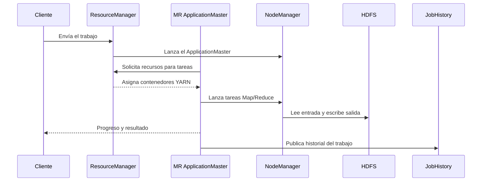

# YARN, servicios y puertos

## Qué es YARN

YARN significa **Yet Another Resource Negotiator**. Separa dos problemas:

1. decidir cómo repartir CPU y memoria entre aplicaciones;
2. ejecutar y vigilar tareas en los nodos del clúster.

MapReduce es una aplicación que utiliza YARN, pero YARN no está limitado a
MapReduce. Otros motores pueden usarlo como administrador de recursos.

## Componentes de YARN

### ResourceManager

Es la autoridad global que acepta aplicaciones y arbitra los recursos del
clúster. Su scheduler decide qué aplicación obtiene capacidad según colas,
prioridades y disponibilidad.

No ejecuta personalmente cada tarea. Coordina el conjunto.

### NodeManager

Existe normalmente uno por máquina trabajadora. Se encarga de:

- lanzar y detener contenedores de YARN;
- vigilar CPU, memoria, disco y red;
- reportar el estado del nodo al ResourceManager;
- ofrecer servicios auxiliares, como el shuffle de MapReduce.

> Un **contenedor de YARN** es una asignación lógica de recursos para ejecutar un
> proceso. No es lo mismo que un **contenedor Docker**, aunque en este laboratorio
> un NodeManager se ejecute dentro de Docker.

### ApplicationMaster

Cada aplicación obtiene su propio ApplicationMaster temporal. Este negocia
contenedores de YARN con el ResourceManager y coordina las tareas de esa
aplicación. En MapReduce existe un ApplicationMaster específico de MapReduce.

### JobHistory Server

YARN muestra aplicaciones activas y recientes, pero MapReduce necesita conservar
información detallada de trabajos ya terminados. JobHistory permite consultar:

- tareas Map y Reduce;
- duración y estado;
- contadores;
- intentos fallidos;
- logs agregados cuando están disponibles.

## Flujo de una aplicación MapReduce



## Los cinco servicios Docker del laboratorio

| Servicio Compose | Tecnología | Responsabilidad |
| --- | --- | --- |
| `namenode` | HDFS | Metadatos y coordinación del sistema de archivos. |
| `datanode` | HDFS | Almacenamiento de bloques. |
| `resourcemanager` | YARN | Recursos, aplicaciones y scheduling global. |
| `nodemanager` | YARN | Ejecución y vigilancia de tareas en el nodo. |
| `historyserver` | MapReduce | Historial de trabajos finalizados. |

## Puertos publicados en el host

| Puerto | Servicio | Qué puedes observar |
| ---: | --- | --- |
| `9870` | NameNode de Hadoop 3 | Capacidad HDFS, DataNodes, archivos, bloques y estado. |
| `50070` | NameNode de Hadoop 2 | La misma función en el entorno Hadoop 2. |
| `8088` | ResourceManager | Aplicaciones YARN, colas, nodos y recursos. |
| `8042` | NodeManager | Contenedores YARN y estado del nodo trabajador. |
| `19888` | JobHistory | Detalle histórico de trabajos MapReduce terminados. |

Direcciones:

- Hadoop 3: <http://localhost:9870>
- Hadoop 2: <http://localhost:50070>
- YARN: <http://localhost:8088>
- NodeManager: <http://localhost:8042>
- JobHistory: <http://localhost:19888>

Son **interfaces web administrativas**, no un escritorio gráfico para construir
jobs arrastrando elementos. El trabajo se envía normalmente mediante CLI, API o
herramientas del ecosistema.

## Puertos internos importantes

No todo puerto necesita publicarse en tu computadora:

| Puerto interno | Uso |
| ---: | --- |
| `8020` | RPC de HDFS: los clientes se comunican con el NameNode. |
| `10020` | RPC del JobHistory Server. |

Los servicios se encuentran por nombres como `namenode`, `resourcemanager` e
`historyserver` dentro de la red de Compose. Publicar un puerto solo es necesario
cuando el host debe acceder a él, como ocurre con las interfaces web.

## Configuración YARN del laboratorio

```xml
<property>
  <name>yarn.resourcemanager.hostname</name>
  <value>resourcemanager</value>
</property>
<property>
  <name>yarn.nodemanager.aux-services</name>
  <value>mapreduce_shuffle</value>
</property>
```

`mapreduce_shuffle` permite que los reducers obtengan las particiones producidas
por los mappers. Sin este servicio auxiliar, un trabajo puede iniciar pero fallar
durante la transferencia de resultados intermedios.

El laboratorio ofrece 2048 MiB lógicos al NodeManager y solicita 512 MiB para
maps, reduces y ApplicationMaster. Es un ajuste pedagógico para una computadora
personal, no una recomendación universal de producción.

## Por qué no se deben iniciar ambas versiones a la vez

Hadoop 2 y Hadoop 3 intentan publicar simultáneamente `8088`, `8042` y `19888`.
Un puerto del host solo puede pertenecer a un proceso a la vez. Detén una versión
antes de iniciar la otra; la red interna y los volúmenes sí son independientes.

## Fuente oficial

- [Arquitectura de Apache Hadoop YARN](https://hadoop.apache.org/docs/current/hadoop-yarn/hadoop-yarn-site/YARN.html)

**Siguiente:** [MapReduce paso a paso](04-mapreduce.md).

