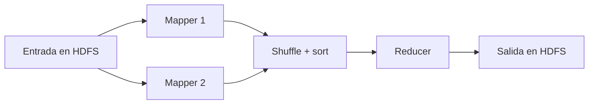

# MapReduce paso a paso

## Qué es MapReduce

MapReduce es un modelo de programación y un motor para procesar grandes
colecciones en paralelo. El programador expresa principalmente dos funciones:

- **Map:** transforma registros de entrada en pares intermedios clave-valor.
- **Reduce:** combina todos los valores asociados a una misma clave.

El framework se ocupa de dividir la entrada, ejecutar tareas, transferir datos
intermedios, ordenar claves, reintentar fallos y escribir resultados.

## El ejemplo WordCount

Entrada:

```text
big data hadoop
big data docker hadoop
```

### 1. Input y splits

Hadoop utiliza un `InputFormat` para interpretar archivos y crear divisiones
lógicas llamadas `InputSplit`. Cada split se asigna normalmente a un mapper.
Un split no es necesariamente igual a un bloque HDFS, aunque Hadoop intenta
aprovechar la localidad de los bloques.

### 2. Map

Cada mapper procesa registros y emite pares:

```text
(big, 1) (data, 1) (hadoop, 1)
(big, 1) (data, 1) (docker, 1) (hadoop, 1)
```

Los mappers pueden ejecutarse en paralelo porque cada uno trabaja sobre una
porción de la entrada.

### 3. Combiner opcional

Un combiner puede realizar agregación local antes de enviar datos por la red.
Por ejemplo, transformar dos pares `(big, 1)` producidos localmente en
`(big, 2)`. Es una optimización: Hadoop no garantiza cuántas veces se ejecutará,
por lo que la lógica debe ser segura aun si no se usa.

### 4. Partition

El partitioner decide qué reducer recibirá cada clave. Todas las apariciones de
una misma clave deben llegar al mismo reducer para poder agruparse correctamente.

### 5. Shuffle y sort

Esta es la parte que con frecuencia se omite al explicar MapReduce y es
FUNDAMENTAL:

- **Shuffle:** transfiere a cada reducer su partición de la salida de todos los
  mappers.
- **Sort/group:** ordena las claves y agrupa sus valores.

Resultado conceptual:

```text
big     [1, 1]
data    [1, 1]
docker  [1]
hadoop  [1, 1]
```

El shuffle puede ser costoso porque implica disco, serialización y red.

### 6. Reduce

El reducer recibe una clave y su colección de valores:

```text
(big, [1, 1])       -> (big, 2)
(data, [1, 1])      -> (data, 2)
(docker, [1])       -> (docker, 1)
(hadoop, [1, 1])    -> (hadoop, 2)
```

### 7. Output

Un `OutputFormat` escribe el resultado en HDFS. La salida del laboratorio aparece
en un archivo como `part-r-00000` porque se utiliza un reducer.



## MapReduce y YARN no son lo mismo

MapReduce define y coordina el procesamiento. YARN le entrega recursos para
ejecutarlo:

1. el cliente envía el job;
2. ResourceManager inicia un ApplicationMaster de MapReduce;
3. el ApplicationMaster solicita contenedores YARN;
4. NodeManager ejecuta las tareas Map y Reduce;
5. las tareas leen y escriben en HDFS;
6. JobHistory conserva la información final.

La propiedad que conecta MapReduce con YARN es:

```xml
<property>
  <name>mapreduce.framework.name</name>
  <value>yarn</value>
</property>
```

## Por qué fue tan influyente

El programador no necesita implementar manualmente:

- distribución de archivos;
- coordinación entre máquinas;
- agrupamiento global de claves;
- reintentos de tareas;
- seguimiento de progreso;
- escritura paralela de resultados.

Eso convirtió problemas como agregación de logs, construcción de índices y ETL
masivo en pipelines expresables con una estructura común.

## Cuándo funciona bien

- procesamiento batch de grandes volúmenes;
- transformaciones fáciles de dividir;
- agregaciones por clave;
- trabajos donde importa más el throughput total que la respuesta inmediata.

## Cuándo no funciona bien

- consultas interactivas de milisegundos;
- algoritmos muy iterativos que releen el mismo conjunto muchas veces;
- procesamiento de eventos en tiempo real;
- datos pequeños que caben cómodamente en una sola máquina.

MapReduce suele escribir etapas intermedias en disco. Motores como Spark pueden
ser más adecuados para procesamiento iterativo o interactivo, aunque también
pueden utilizar HDFS y ejecutarse sobre YARN.

## Ejecutarlo en el laboratorio

Desde `hadoop2/` o `hadoop3/`:

```bash
./scripts/start.sh
./scripts/smoke-test.sh
```

Después observa la aplicación en <http://localhost:8088> y su historial en
<http://localhost:19888>.

## Fuentes oficiales

- [Tutorial de MapReduce](https://hadoop.apache.org/docs/current/hadoop-mapreduce-client/hadoop-mapreduce-client-core/MapReduceTutorial.html)
- [API de Reducer: shuffle, sort y reduce](https://hadoop.apache.org/docs/current/api/org/apache/hadoop/mapreduce/Reducer.html)

**Siguiente:** [Herramientas y operación](05-herramientas-y-operacion.md).

