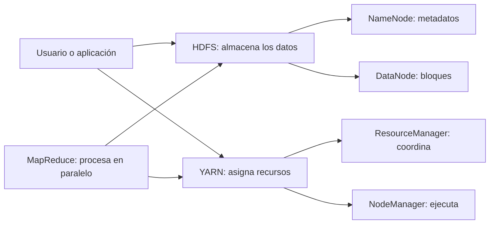

# Guía de estudio de Hadoop

Esta carpeta explica los conceptos que aparecen en los laboratorios de este
repositorio. La intención no es memorizar comandos: es entender **qué problema
resuelve cada componente, cómo colaboran y qué limitaciones tiene el entorno**.

## Ruta recomendada

1. [Fundamentos de Hadoop](01-fundamentos-de-hadoop.md)
2. [HDFS: almacenamiento distribuido](02-hdfs.md)
3. [YARN, servicios y puertos](03-yarn-servicios-y-puertos.md)
4. [MapReduce paso a paso](04-mapreduce.md)
5. [Herramientas y operación del laboratorio](05-herramientas-y-operacion.md)
6. [Potencia, casos de uso y limitaciones](06-potencia-casos-de-uso-y-limitaciones.md)

## Mapa mental

Una forma sencilla de recordarlo:

- **HDFS decide dónde viven los datos.**
- **YARN decide dónde y con qué recursos se ejecuta el trabajo.**
- **MapReduce define cómo dividir y combinar el procesamiento.**
- **Docker empaqueta los procesos para el laboratorio; no reemplaza esos
  conceptos.**

## Relación con este repositorio

| Concepto | Hadoop 2 | Hadoop 3 |
| --- | --- | --- |
| Definición de servicios | [`hadoop2/compose.yaml`](../../hadoop2/compose.yaml) | [`hadoop3/compose.yaml`](../../hadoop3/compose.yaml) |
| HDFS | [`hadoop2/config/hdfs-site.xml`](../../hadoop2/config/hdfs-site.xml) | [`hadoop3/config/hdfs-site.xml`](../../hadoop3/config/hdfs-site.xml) |
| MapReduce | [`hadoop2/config/mapred-site.xml`](../../hadoop2/config/mapred-site.xml) | [`hadoop3/config/mapred-site.xml`](../../hadoop3/config/mapred-site.xml) |
| YARN | [`hadoop2/config/yarn-site.xml`](../../hadoop2/config/yarn-site.xml) | [`hadoop3/config/yarn-site.xml`](../../hadoop3/config/yarn-site.xml) |

## Alcance del laboratorio

Los contenedores ejecutan Hadoop real, pero todos viven en una sola computadora.
Esto permite aprender la separación entre servicios, HDFS, YARN y MapReduce sin
instalar Java ni Hadoop en Arch Linux. **No convierte una computadora en un
clúster de producción**: con un único DataNode y replicación `1` no existe
tolerancia real ante la pérdida de un nodo.

## Fuentes principales

- [Módulos oficiales de Apache Hadoop](https://hadoop.apache.org/modules.html)
- [Arquitectura de HDFS](https://hadoop.apache.org/docs/current/hadoop-project-dist/hadoop-hdfs/HdfsDesign.html)
- [Arquitectura de YARN](https://hadoop.apache.org/docs/current/hadoop-yarn/hadoop-yarn-site/YARN.html)
- [Tutorial oficial de MapReduce](https://hadoop.apache.org/docs/current/hadoop-mapreduce-client/hadoop-mapreduce-client-core/MapReduceTutorial.html)

